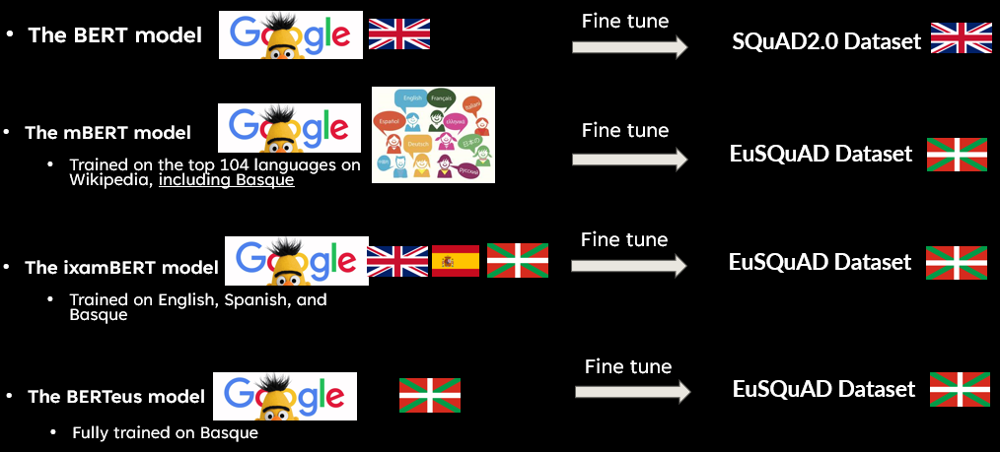

# LLM QA on Minority Languages, the case of the Basque Language

This project aims to explore and develop a question-answering system for the Basque language using a large language model (LLM). The notebook demonstrates how to apply state-of-the-art language models to build an effective QA system, specifically tailored for a less commonly studied language like Basque.

## Table of Contents
- [Introduction](#introduction)
- [Example Predictions](#example-predictions-what-is-the-objective-of-this-project)
- [Features](#features)
- [Installation](#installation)
- [Usage](#usage)
- [Project Structure](#project-structure)
- [Contributing](#contributing)
- [License](#license)

## Introduction

The Basque language is unique, with a limited number of resources compared to more widespread languages. This project provides a baseline for creating a question-answering system in Basque by leveraging existing LLMs, NLP techniques, and datasets to bridge the gap in linguistic technology for underrepresented languages.



## Example predictions: What is the objective of this project?
The QA system is demonstrated with examples in both English and Basque:

```
Context: 
Most importantly, the main objective of this work is to raise awareness of the importance of supporting and advancing NLP research in minority languages. By showcasing the potential of adapting large language models to underrepresented languages like Basque, I hope to encourage further exploration and investment in this area. Future work could focus on improving the quality and size of training data, developing more sophisticated models tailored to the linguistic properties of Basque, or using tools to expand and educate the Basque-speaking ML community about the workarounds of NLP architectures, and how these models learn language concepts.

Question: What is the main aim of this work?
Predicted Answer: to raise awareness of the importance of supporting and advancing nlp research in minority languages

Question: What would I like to encourage?
Predicted Answer: further exploration and investment

Question: What can we teach the Basque-speaking ML community?
Predicted Answer: workarounds of nlp architectures

Question: What could future work focus on?
Predicted Answer: improving the quality and size of training data
```

In Basque:

```
Context: 
Lan honen helburu nagusia NLPren ikerketa hizkuntza gutxituetan babestu eta aurrera egitearen garrantziaz sentsibilizatzea da. Hizkuntza-eredu handiak ordezkaritza txikia duten hizkuntzetara (euskarara, esaterako) egokitzeko ahalmena erakutsiz, esparru horretan esplorazio eta inbertsio gehiago sustatzea espero dut. Etorkizuneko lana izan liteke entrenamendu datuen kalitatea eta tamaina hobetzea, euskararen hizkuntza-ezaugarrietara egokitutako eredu sofistikatuagoak garatzea, edo euskera-hiztunen artean ML komunitatea zabaltzea, horretarako NLP arkitekturen inguruan ezaguera zabalduz. 

Question: Zein izan da lan honen helburua?
Predicted Answer: ikerketa hizkuntza gutxituetan babestu eta aurrera egitearen garrantziaz sentsibilizatzea

Question: Nola zabaldu daiteke euskera-hiztunen artean ML komunitatea?
Predicted Answer: NLP arkitekturen inguruan ezaguera zabalduz

Question: Zer hobekuntzak egin daitezke etorkizunean?
Predicted Answer: entrenamendu datuen kalitatea eta tamaina
```

## Features
- A notebook-based workflow to develop a QA system for the Basque language, and explanations on NLP concepts and techniques.
- Leverages pretrained large language models to answer questions in Basque.
- Step-by-step explanations to assist other researchers and developers interested in NLP for low-resource languages.
- Visualization of the NLP architectures: layers, attention heads, and token embeddings.
- Visualization of QA model workarounds: how models predict answers and attention mechanisms for relevant question-answer pairs.

## Installation

To get started with this project, follow these steps:

1. Clone the repository:
   ```bash
   git clone https://github.com/asortubay/LLM_QA_Basque.git
   ```
2. Navigate into the project directory:
   ```bash
   cd LLM_QA_Basque
   ```

## Usage

To use the notebook and experiment with the QA system:

1. Open the Jupyter Notebook:
   ```bash
   jupyter notebook LLM_QA_on_Basque.ipynb
   ```
2. Follow the instructions in the notebook to run different sections of the code.

This notebook will guide you through the process of training, testing, and evaluating the QA model.

## Project Structure
- **LLM_QA_on_Basque.ipynb**: Main Jupyter Notebook demonstrating the QA implementation.
- **LLM_QA_on_Basque.pptx**: A short presentation I gave on the project.
- **eusquad_v1.0/** and **/squad2.0.py**: Directory to store the Basque datasets used for training, evaluation and testing.
> Note: They are not included in the repository but are available at the original sources. The EuSQuAD dataset is preprocessed using the eusquad_v1.0/convert_json.py script.
- **results/**: Saved models and checkpoints.
> Note: The models are not included in the repository due to their size, but can be shared upon request.
- **custom_scripts.py**: Main training and evaluation scripts.
- **evaluate-v2.0.py**: Official Evaluation script for the SQuAD 2.0 dataset.

> Note: Any directory containing the word "checkpoint" should be ignored.

## Contributing

Contributions are welcome! If you want to contribute, please fork the repository and submit a pull request. For major changes, please open an issue first to discuss what you would like to change.

## License

This project is licensed under the MIT License - see the [LICENSE](LICENSE) file for details.

